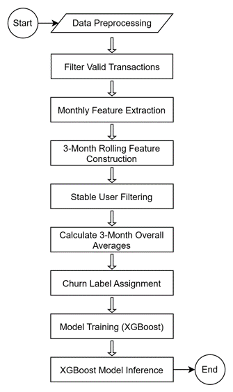
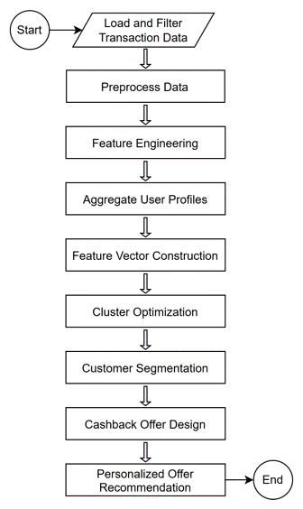
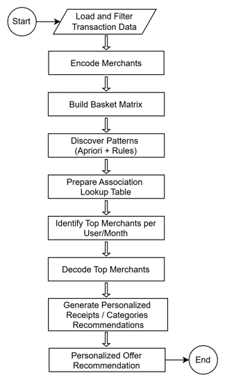

# CLIS: Financial Behavior Intelligence

A modular analytics framework for behavioural signal analysis, transaction intelligence, customer-risk modelling, customer segmentation, and intervention-oriented decision support in regulated financial environments.

## Overview

This repository presents a refactored implementation of the Customer Loyalty Improvement System (CLIS), originally developed as a modular analytics pipeline for transforming transaction data into actionable behavioural insights. In a financial-services setting, the system supports transaction cleaning, spending analysis, expenditure categorisation, churn modelling, customer segmentation, and prototype intervention logic.

Although implemented in a financial context, the broader value of the repository lies in its transferable workflow patterns: structured preprocessing of sequential records, interpretable behavioural feature construction, modular machine learning pipelines, and decision-support outputs in regulated, data-intensive environments.

## Methodological Relevance

Although this repository is implemented in a financial-services context, it demonstrates technical patterns that are relevant to other data-intensive and regulated environments. These include:

- end-to-end pipeline construction for sequential and behavioural data
- transformation of raw records into interpretable features for downstream modelling
- modular machine learning workflows for risk-oriented analytics
- production of structured outputs that can support monitoring and intervention decisions
- practical emphasis on data quality, interpretability, and responsible use

The project should therefore be understood primarily as a demonstration of modular applied machine learning and behavioural analytics capability, rather than as a domain-specific production system.

## Current Refactored Workflow

The repository currently follows this sequence:

1. **Preprocessing**
   - validate schema and required columns
   - remove invalid, duplicate, or incomplete records
   - standardise account identifiers and timestamps
   - construct a unified `Datetime` field
   - extract consumer-initiated spending transactions

2. **Exploratory Data Analysis**
   - generate descriptive figures aligned with the project write-up
   - summarise spending by category
   - summarise transaction frequency by category
   - visualise filtered transaction amount distributions

3. **Transaction Categorisation**
   - construct merchant-derived expenditure labels
   - build a categorized transaction dataset for downstream modules
   - provide an optional Random Forest categorisation experiment based on merchant, amount, balance, and temporal features

4. **Churn Modelling**
   - build rolling 3-month behavioural features
   - derive churn labels from activity and recency rules
   - train and evaluate an XGBoost churn model
   - generate probability-based churn predictions

5. **Customer Segmentation**
   - engineer account-level behavioural features
   - combine numeric behaviour with merchant-text features
   - evaluate candidate cluster counts
   - fit KMeans customer segments
   - generate a prototype segment-level offer assignment

6. **Recommendation / Intervention Layer**
   - currently represented by prototype offer-assignment logic
   - intended to be further separated into a clearer downstream recommendation module

## Implemented Modules

### 1. Data Module (`src/clis/data/`)
Handles:
- transaction preprocessing
- consumer-spending extraction
- EDA figure generation

### 2. Categorisation Module (`src/clis/categorization/`)
Handles:
- merchant-to-category mapping
- labeled transaction preparation
- optional Random Forest categorisation experiment
- category prediction outputs

### 3. Churn Module (`src/clis/churn/`)
Handles:
- rolling-window feature and label generation
- XGBoost training and evaluation
- churn model wrapping
- churn prediction output generation

### 4. Segmentation Module (`src/clis/segmentation/`)
Handles:
- customer-level feature engineering
- cluster-count evaluation
- KMeans segmentation
- prototype segment-based offer assignment

### 5. Recommendation Module (`src/clis/recommendation/`)
Reserved for a cleaner downstream recommendation module as the current prototype logic is separated further.

## Detailed Workflow Diagrams

### Churn Modelling Workflow

This workflow covers the end-to-end churn pipeline, from cleaned transaction records to final XGBoost-based churn inference.

**Main stages**
- Data Preprocessing
- Filter Valid Transactions
- Monthly Feature Extraction
- 3-Month Rolling Feature Construction
- Stable User Filtering
- Calculate 3-Month Overall Averages
- Churn Label Assignment
- Model Training (XGBoost)
- XGBoost Model Inference

### Customer Segmentation Workflow

This workflow covers the segmentation pipeline used to transform categorized transaction behaviour into customer groups and downstream cashback-design logic.

**Main stages**
- Load and Filter Transaction Data
- Preprocess Data
- Feature Engineering
- Aggregate User Profiles
- Feature Vector Construction
- Cluster Optimization
- Customer Segmentation
- Cashback Offer Design
- Personalized Offer Recommendation

### Recommendation / Association Workflow

This workflow represents the association-rule-driven recommendation path, where merchant patterns are transformed into lookup rules and then into personalized offer recommendations.

**Main stages**
- Load and Filter Transaction Data
- Encode Merchants
- Build Basket Matrix
- Discover Patterns (Apriori + Rules)
- Prepare Association Lookup Table
- Identify Top Merchants per User/Month
- Decode Top Merchants
- Generate Personalized Receipts / Categories Recommendations
- Personalized Offer Recommendation

## Repository Structure

- `docs/` workflow figures and supporting project notes
- `data/raw/` raw input data placeholders
- `data/processed/` processed transaction, churn, and segmentation tables
- `notebooks/` exploratory notebooks retained for reference
- `outputs/figures/` generated visualisations for EDA, categorisation, churn, and segmentation
- `outputs/metrics/` evaluation reports and clustering score outputs
- `outputs/models/` saved model files generated locally
- `outputs/predictions/` predicted outputs from categorisation, churn, and segmentation steps
- `src/clis/data/` preprocessing and EDA
- `src/clis/categorization/` category mapping and categorisation pipeline
- `src/clis/churn/` churn feature engineering, model training, and prediction
- `src/clis/segmentation/` customer feature engineering, clustering, and prototype offer assignment
- `src/clis/recommendation/` reserved for a cleaner downstream recommendation module
- `scripts/` helper scripts and notebook exports
- `reports/` report materials and supporting writeups

## Current Status

The repository has been substantially cleaned into a staged workflow with reusable modules for:
- preprocessing
- EDA
- categorisation
- churn
- segmentation

The dedicated recommendation layer remains lighter than the other modules and is currently represented by prototype segment-level offer assignment rather than a fully independent recommendation engine.

## Methodological Notes

This project demonstrates transferable technical capability in:
- preprocessing raw sequential records
- constructing interpretable behavioural features
- training modular ML components for categorisation and churn
- unsupervised customer segmentation
- producing structured outputs for downstream decision support

The categorisation stage should be interpreted carefully: merchant-derived rules are the primary source of expenditure labels, and the supervised categorisation experiment should be treated as a learned approximation of those labels rather than as a fully independent ground-truth classification system.

Similarly, the current offer-assignment stage should be understood as a prototype segmentation-based intervention layer rather than a mature personalised recommendation system.

