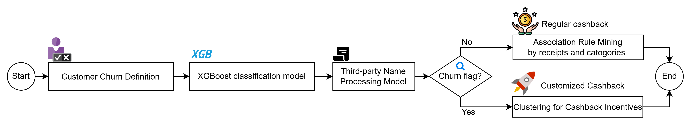

# CLIS: Financial Behavior Intelligence

A modular analytics framework for behavioural risk detection, transaction intelligence, customer segmentation, and targeted intervention design in regulated financial environments.

This repository presents a reproducible machine learning pipeline for transforming high-volume transaction data into interpretable signals that support early identification of behavioural change, transaction-level behaviour understanding, and data-driven intervention design. Although demonstrated in a financial-services context, the system reflects broader methodological and engineering challenges common to regulated decision-support environments, including large-scale behavioural data processing, interpretable modelling, modular deployment, and action-oriented analytics.

## Why This Matters

Modern institutions operating in regulated environments must convert large volumes of behavioural and operational data into timely, interpretable, and actionable insights. In a financial-services setting, systems like CLIS are relevant to early disengagement detection, transaction understanding, customer cohort discovery, and intervention design. More broadly, this repository illustrates how machine learning pipelines can be structured to support monitoring-oriented analytics, early signal detection, and decision-support workflows in data-rich environments.

## System Architecture

The repository is organised as a modular pipeline covering:

- data ingestion and preprocessing
- transaction filtering and behavioural feature engineering
- behavioural risk detection
- transaction intelligence and spending categorisation
- customer segmentation
- recommendation and intervention-oriented analytics
- visualisation and reporting

## Core Modules

### 1. Data Preparation
Cleans and validates transaction records, handles missing and abnormal values, standardises account and timestamp fields, and prepares analysis-ready datasets.

### 2. Behavioural Risk Detection
Builds rolling-window behavioural features such as spending, visit frequency, and recency, then applies supervised learning to estimate disengagement risk.

### 3. Transaction Intelligence
Transforms merchant-level transaction data into interpretable spending categories and behavioural signals for downstream modelling and analysis.

### 4. Behavioural Customer Segmentation
Applies feature engineering and clustering techniques to identify distinct customer groups based on spending behaviour, activity patterns, and merchant interactions.

### 5. Recommendation and Targeted Intervention Design
Uses rule-based recommendation logic and behavioural patterns to generate targeted intervention or offer suggestions.

### 6. Visualisation and Reporting
Provides exploratory analysis, behavioural summaries, and model-output visualisations to support interpretation and communication of findings.

## Repository Structure

- `docs/` project documentation, workflow figures, and supporting notes
- `configs/` configuration files for module-specific settings
- `data/` raw, interim, processed, and sample data placeholders
- `notebooks/` exploratory analysis and module-specific prototype notebooks
- `src/clis/` source code for preprocessing, modelling, segmentation, recommendation, and visualisation
- `scripts/` runnable entry points for training, inference, and reporting
- `outputs/` generated predictions, recommendations, figures, metrics, model files, and sample results
- `reports/` report materials and supporting writeups

## Responsible Use

This repository is intended as a research and engineering prototype. Any real-world deployment should account for privacy, data governance, explainability, fairness, auditability, and appropriate human oversight. Predictive and behavioural outputs should be interpreted cautiously and should not be used in isolation for consequential decision-making.

## Methodological Relevance

This repository demonstrates transferable technical capability in modular machine learning system design, behavioural signal analysis, interpretable segmentation, and intervention-oriented decision support in regulated data environments. While implemented in a financial-services setting, the underlying methodological patterns are relevant to broader monitoring, early risk-identification, and decision-support workflows across other data-intensive and regulated domains.

In particular, the repository reflects technical patterns that are also important in higher-stakes settings: converting raw sequential data into interpretable features, identifying meaningful behavioural or operational shifts early, producing structured analytical outputs that support downstream action, and organising machine learning systems in a modular and reproducible manner. For that reason, this project should be viewed as a demonstration of transferable analytical and engineering capability rather than as a domain-specific deployment.

## Relation to Broader Research Direction

The methods demonstrated in this repository are consistent with a broader research direction focused on practical AI systems for earlier identification of risk, abnormal conditions, and actionable patterns in complex environments. Although the implementation here is grounded in financial transaction data, the same system-design principles—feature extraction from sequential records, interpretable monitoring-oriented analytics, modular model pipelines, and action-support outputs—are relevant to other settings that require reliable monitoring and decision support under operational constraints.

## Notes

- Raw proprietary or sensitive data are not included in this repository.
- The repository is designed to separate source code, data placeholders, outputs, and report materials to support reproducibility and clearer project presentation.
- This project should be understood as a modular applied machine learning prototype rather than a production deployment.
